# Schwi.py

A discord bot featuring a full [4x](https://en.wikipedia.org/wiki/4X) game
system, including fog of war, path-finding, combat, resources, building and more.

Powered by discord.py and MongoDB.

- [Core Concept](#core-concept)
- [Features](#features)
- [Commands](#commands)
- [Game Units](#game-units)
- [Economy](#economy)
- [Credit](#credit)

## Core Concept

The game system is a medieval 4x game played entirely over discord,
through a command interface with the bot [Schwi]().

Each team will start with a Headquarters and one player unit corresponding
to every member in the team.

Players can command their units using `.command (id)`
where id is an optional parameter representing the id
of the unit that the player wants to control.
If you don't provide a parameter you will control your own player unit.

To view the units that you own use `.units`.

To view all the units corresponding to players from your race use `.units all`.

The units that are produced or trained by players (non-player units),
can be controlled by the player who trained them.

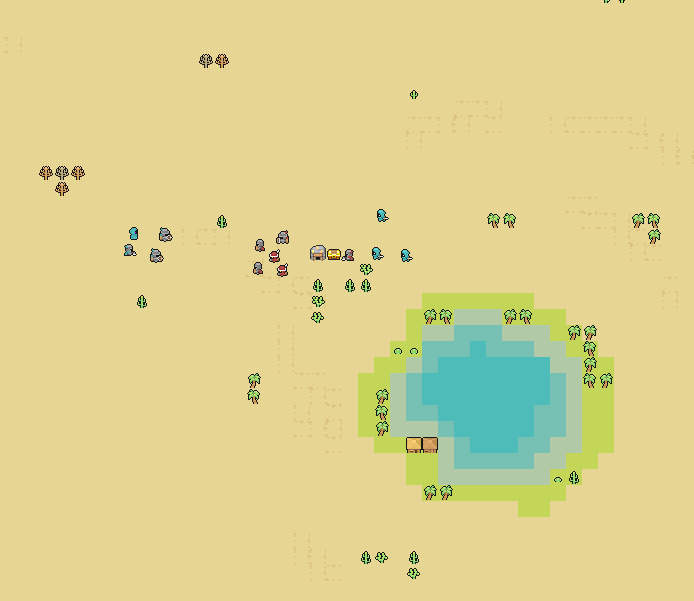
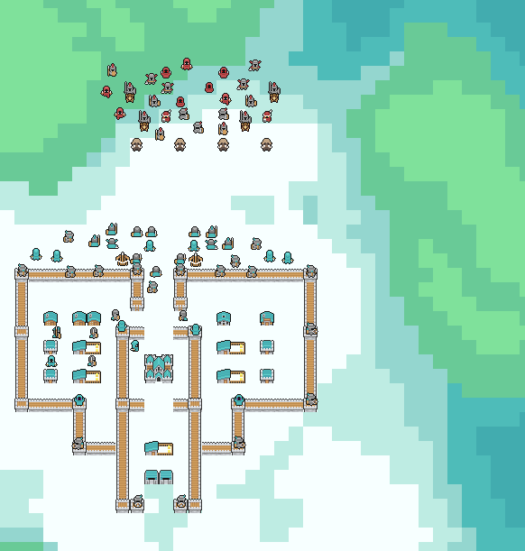

## Features

### Command Based Interface

The game system is played entirely over discord using text commands.
Users can interact with the bot by sending commands, and they
receive feedback from the bot as a response.

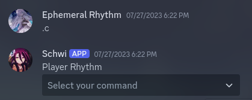
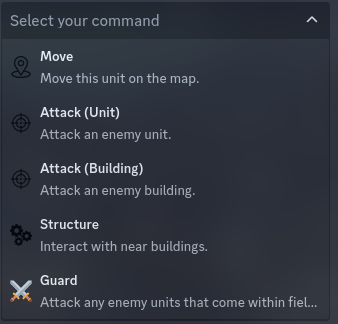

Full list of commands can be viewed here.

### Fog of War

At the start of the game, the full map is covered in fog of war, apart
from a small area near the team HQ. Teams are expected to explore the
map, unlocking new areas to gain resources and intellect on opposing teams.

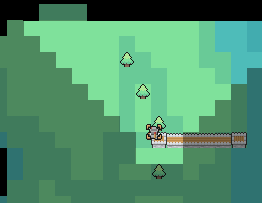

Any node in the map belongs to one of the three types:

- Visible: A node is visible if it is within the sight of a unit
  belonging to the team (bright nodes)
- Unexplored: a node is unexplored if it never was within the sight
  of any unit belonging to the team since the start of the game. (black nodes)
- Out of Sight: a node is out of sight if it was previously visible,
  but became out of sight of the unit. (grey tinted nodes)

Fog of war is implemented by keeping track of the unexplored nodes, and
searching for the visible nodes every game tick.

Visible nodes can change depending on the position of the team units.

### Path-Finding

The game system uses the A\* algorithm for path-finding. A\* is a
modification of Dijkstra's algorithm in which we use some kind of
heuristic function to make an _educated guess_ over what nodes
we should search next.

For the purpose of this project, we used the manhattan distance
between two nodes as the heuristic function.

The game system features two types of units, naval and land units.
Naval units can only navigate through water nodes, while land
units can navigate through land nodes **that are not blocked by walls**.

Land units can use boats to navigate over water nodes.

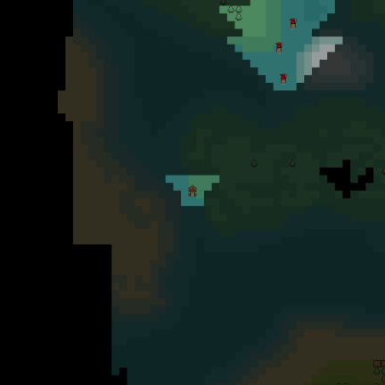

### Combat

Arguably the most important aspect of the game system, because
what kind of 4x game doesn't have good combat!

Schwi provides a diverse combat system as there are different types of
units (ranged, melee) and units have different stats for movement speed,
attack damage, attack recharge and health points.

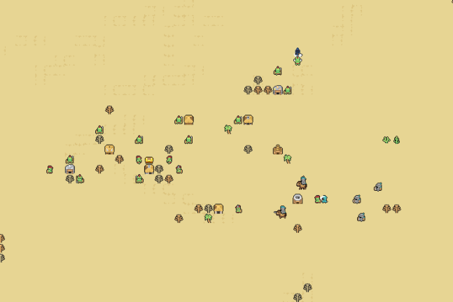

### Buildings

Teams can use resources they gather from the map to construct new
buildings. Buildings serve different purposes such as training
new units or helping in gathering more resources and weapons.

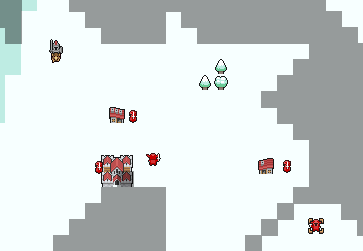

Players can interact with buildings using commands.

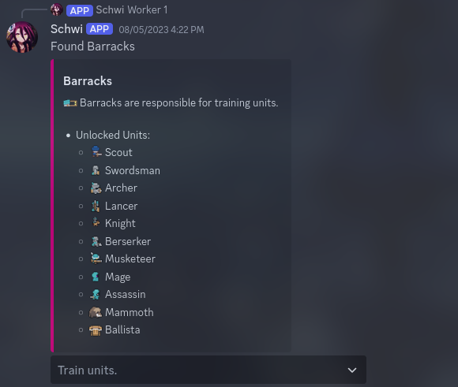
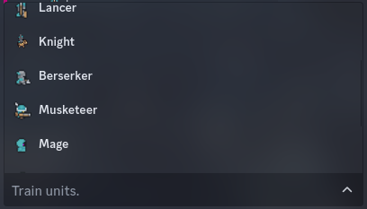

## Commands

### Map

**Description:**
Views the game map. The bot will display a cropped image of the map centered around the location of the unit selected.
The unit selected for the command will be displayed inside a box selector.

Every tile on the map is 16 x 16 pixels. The positive direction for the x-axis is to the right, the positive direction for the y-axis is downwards.

**Syntax:**
`.map (unit_id)`

`unit_id` is an optional argument that represents the id of the unit that you want to use the command from.

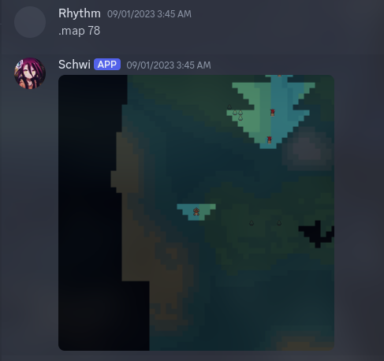

### Units

**Description:**
Displays all the unit that belong to the player with their ids.

**Syntax:**
`.units (all)`

(all) is an optional argument, when used the bot will display all the units that belong to your team.

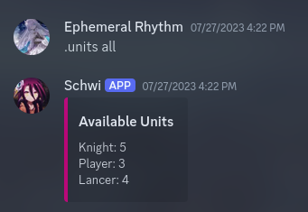

### Give

**Description:**
Gives another player a specific amount of resources.

**Syntax:**
`.give [member] [amount] [wood/stone/iron/gold/coins]`

All of the above arguments are necessary.

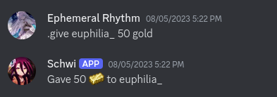

### Inv

**Description:**
Shows the amount of resources that a player is holding. You can only view the amount of resources by players of the same race as you.

**Syntax:**
`.inv (member)`

`member` is an optional argument.

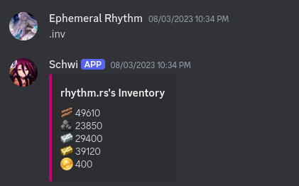

### Status

**Description:**
Shows the status of a certain unit. This includes information such as the unit hp, resources or objects that they have in their inventory, as well as information on the command the unit is currently executing.

**Syntax:**
`.status (unit_id)`

`unit_id` is an optional argument, if not provided then the bot will show the status of the player unit.

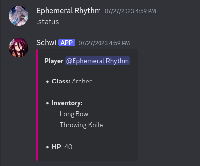

### StatusAll

**Description:**
This shows information on every unit executing a command, including the command the unit is performing and the relevant information.

**Syntax:**
`.statusall`

### Command

**Description:**
Commands a unit on the map. You can only command units that you own.

**Syntax:**
`.command (unit_id)`

`unit_id` is an optional argument. When not provided the command controls your own player unit.

### Reassign

**Description:**
Changes the ownership of a unit. This command can only be used by the team leader or the player who owns said unit.

**Syntax:**
`.reassign [unit_id] [member]`

All arguments are required.

### Pings

**Description:**
Customizes your notification settings.

**Syntax:**
`.pings`

### GetPings

**Description:**
Views your notification settings.

**Syntax:**
`.getpings`

## Game Units

- Worker

  - attack: 4
  - attack recharge: 0
  - hitpoints: 20
  - range: melee (8 pixels)
  - sight: 6 tiles
  - speed: 8

- Scout

  - attack: 6
  - attack recharge: 0
  - hitpoints: 25
  - range: melee (8 pixels)
  - sight: 10 tiles
  - speed: 16

- Swordsman

  - attack: 8
  - attack recharge: 0
  - hitpoints: 40
  - range: melee (8 pixels)
  - sight: 8 tiles
  - speed: 16

- Archer

  - attack: 6
  - attack recharge: 1
  - hitpoints: 25
  - range: 6 tiles
  - sight: 8 tiles
  - speed: 16

- Lancer

  - attack: 10
  - attack recharge: 0
  - hitpoints: 40
  - range: melee (16 pixels)
  - sight: 8 tiles
  - speed: 12

- Knight

  - attack: 12
  - attack recharge: 0
  - hitpoints: 50
  - range: melee (16 pixels)
  - sight: 8 tiles
  - speed: 32

- Berserker

  - attack: 40
  - attack recharge: 3
  - hitpoints: 40
  - range: melee (8 pixels)
  - sight: 8 tiles
  - speed: 12

- Mage

  - attack: 15 AOE
  - attack recharge: 5
  - hitpoints: 20
  - range: 6 tiles
  - sight: 8 - circular sight
  - speed: 12

- Assassin

  - attack: 25
  - attack recharge: 0
  - hitpoints: 25
  - range: melee (8 pixels)
  - sight: 6 tiles
  - speed: 24

- Mammoth

  - attack: 20
  - attack recharge: 5
  - hitpoints: 120
  - range: melee (8 pixels)
  - sight: 4 tiles
  - speed: 5

- Ballista

  - attack: 40
  - attack recharge: 10
  - hitpoints: 20
  - range: 8 tiles
  - sight: 4 tiles
  - speed: 8

- Battleships

  - attack: 30
  - attack recharge: 5
  - hitpoints: 140
  - range: 5 tiles
  - sight: 8 tiles
  - speed: 24

- Boats
  - hitpoints: 50
  - speed: 16
  - range: 1

## Economy

The game features an economy system with various resources.

#### 1. Wood

Wood can be gathered by chopping down trees. It is mainly used for construction.

#### 2. Stone

Stone can be gathered by breaking rocks or from stone quarries. It is also mainly used for construction.

#### 3. Iron

Iron can be extracted from iron mines. It is used for construction as well as training certain types of units.

#### 4. Gold

The universal resource in the game. Gold is a general purpose currency that can be used for training units, constructing buildings and unlocking new technologies. Gold can be gathered in a variety of ways, such as gold mines, completing quests, exploration, and trading.

## Credit

- All of the in-game art work belongs to [Shade](https://merchant-shade.itch.io/),
  the [Mini World Sprites Pack](https://merchant-shade.itch.io/16x16-mini-world-sprites) provided most of the assets for
  the project.
- Huge thanks to [@eniraa](https://github.com/eniraa) for his major contribution to the project.
